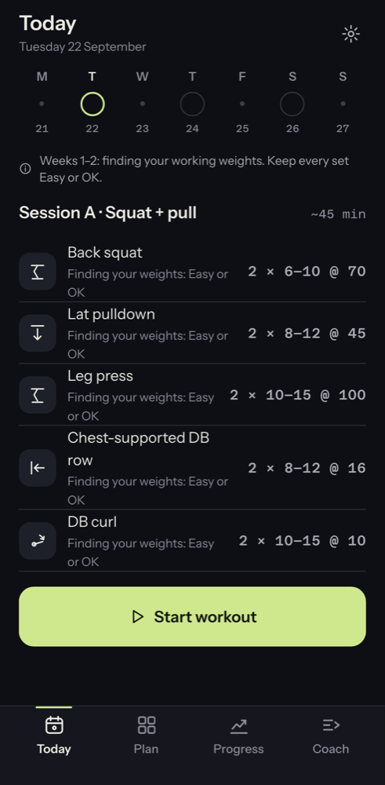
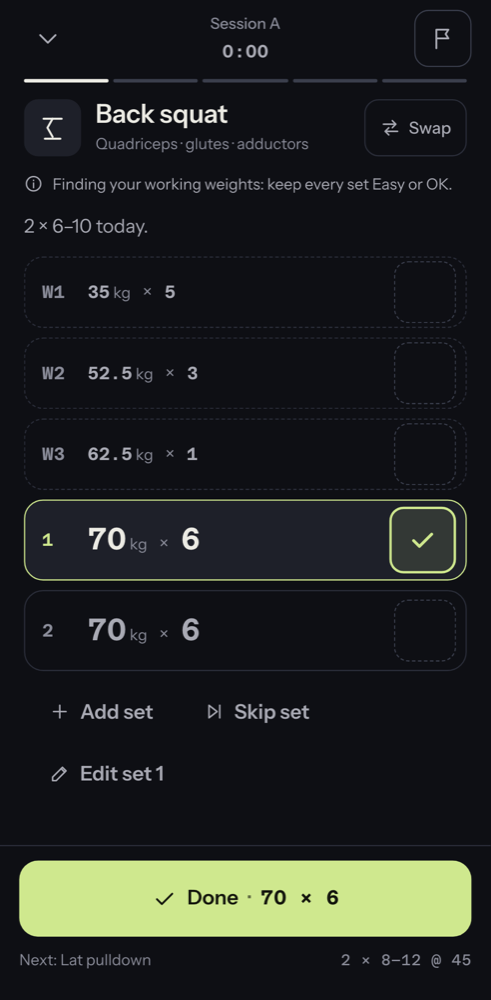
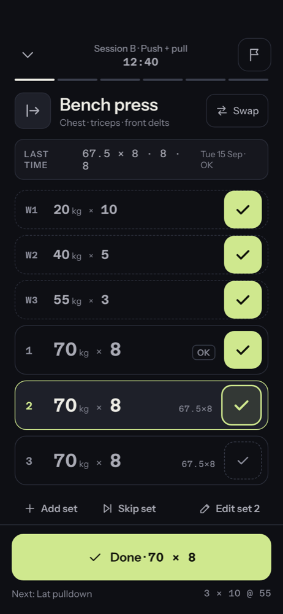
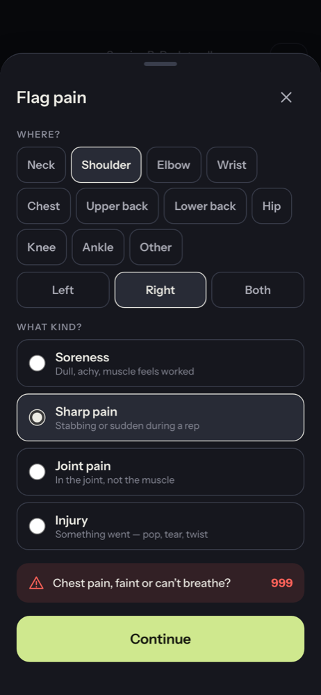
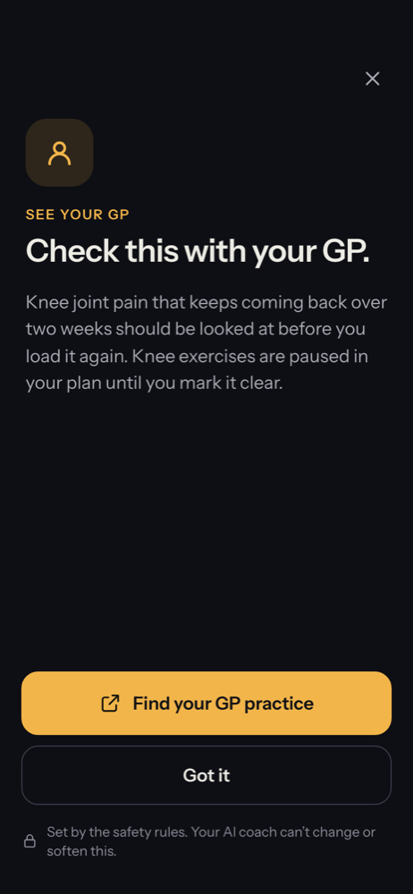
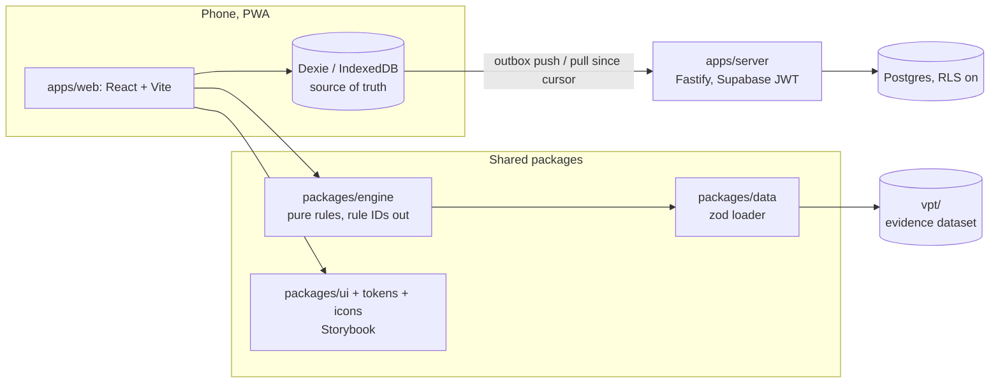

# Tare

A mobile-first gym-logging PWA where **pain flags run through fixed safety rules that no AI can soften**, and progression comes from a rules engine you can audit.

[](https://github.com/waq-b/tare-app/actions/workflows/ci.yml)

[Storybook (design system)](https://tare-storybook.onrender.com) · [Design system notes](docs/DESIGN.md) · [Decisions](docs/decisions.md) · [Evidence dataset](vpt/README.md)

| Running app: Today                                                           | Running app: active workout                                                    |
| ---------------------------------------------------------------------------- | ------------------------------------------------------------------------------ |
|  |  |

Screenshots above are the real app (built in its end-to-end test mode, with fictional data).

## Why it exists

Most training apps either only log sets, or hand your programming to a black-box AI. I wanted a logger I would actually use at the gym, with a coach I can audit.

So the design rule is: **rules decide, AI at most proposes.** A rules engine built on a sourced evidence dataset decides what is allowed. Every change it makes carries the ID of the rule behind it, shows up as a chip with its "why", and can be undone. Safety messages come verbatim from the dataset, and every safety rule is validated at load time as `llm_can_override: false`. When there is not enough data, the app says so.

Tare is not medical advice, and the app says so at onboarding.

## What works today

- **Fast logging.** One tap logs a planned set. Wall-clock rest timer, exercise swaps filtered by your kit, resume after interruption.
- **Offline-first.** Every write goes to IndexedDB first and syncs in the background; logging never waits for the network.
- **Rules-driven progression.** Double progression (or two-for-two), stall steps, planned and early deloads, and a new-user ramp, all in `packages/engine`. Increases apply by themselves but are always shown and undoable; stall resets and deloads are offered, not forced.
- **Pain flags and safety.** Flagging pain routes to the matching safety rule and shows its message and services (NHS 111 per UK nation) verbatim. The engine's follow-up actions only reduce load, sets or effort.
- **Onboarding screening.** The dataset's five screening questions adapt the plan (an effort cap, excluded exercises, a GP-first path).
- **Plan, progress, history.** Weekly plan, lift charts, weekly sets per muscle, session history, bodyweight weigh-ins, backup and restore.
- **Design system.** `packages/tokens`, `packages/icons` and `packages/ui`, with a Storybook story for every screen.

### The AI coach: planned, not built

The Coach tab currently shows "Not enough data yet" and then a **rules-only** summary (weight increases, stalled lifts, the next deload). There is no AI in the app and no MCP server yet. The plan is a coach that can only write pending proposals, which a validator checks against the rule IDs and the user's kit before the user accepts or rejects each one. The rule-ID registry (`vpt/data/rule_ids.json`) exists for that purpose.

## Design mockups

These are exports from my design canvas, not the running app (`design/canvas/`). The coach copy in them describes the planned AI feature.

| Design: Ledger workout                                                        | Design: pain flag                                                         | Design: see your GP                                                   |
| ----------------------------------------------------------------------------- | ------------------------------------------------------------------------- | --------------------------------------------------------------------- |
|  |  |  |

## Architecture



| Path                                | What                                                                                                        |
| ----------------------------------- | ----------------------------------------------------------------------------------------------------------- |
| `apps/web`                          | The PWA. Screens read Dexie and render `@tare/ui`                                                           |
| `apps/server`                       | Sync API: verifies the Supabase JWT, applies outbox batches, serves changes since a cursor                  |
| `packages/engine`                   | Pure TypeScript rules: screening, pain routing, progression, stalls, deloads, volume, swaps, starting loads |
| `packages/data`                     | The only loader for `vpt/`: zod schemas plus a minimum-version check                                        |
| `packages/ui`                       | Pure React components, every screen as a Storybook story                                                    |
| `packages/tokens`, `packages/icons` | Design tokens (JSON to CSS variables and TS) and React icons                                                |
| `vpt/`                              | The evidence dataset: 876 exercises and a set of sourced rules (67 rule IDs, 21 safety rules)               |

## Stack

TypeScript (strict), React, Vite, CSS Modules on CSS custom properties, Dexie, Fastify, Supabase (Postgres and email-code auth), Storybook, Vitest, React Testing Library, Playwright, npm workspaces, GitHub Actions.

## Run it locally (no keys needed)

Needs Node 24 (`nvm use`).

```bash
npm ci
npm run storybook -w @tare/ui                          # design library on http://localhost:6006

# the app in its test mode: fake sign-in (code 11111111) and an in-memory mock API
node apps/web/e2e/mock-api.ts &                        # mock sync API on :4175
npm run dev -w @tare/web -- --mode e2e                 # PWA on http://localhost:5173
```

For a real deployment, copy `apps/web/.env.example` and `apps/server/.env.example` and fill in your own Supabase project; see [`docs/deploy.md`](docs/deploy.md).

## Tests and CI

```bash
npm run lint && npm run typecheck && npm test
npm run e2e -w @tare/web          # needs: npx playwright install chromium
```

`npm test` runs the unit tests and every Storybook story as a browser test (render, interactions, axe in both themes), plus a check that the design doc covers every board. At the time of writing that is 141 files and 942 tests. CI also runs the API tests against a Postgres service container (real row-level security), an offline end-to-end run of the logging loop in Chromium, and a check that every design board has a story. The engine has an 8-week simulated-lifter test checked against a golden snapshot.

## Design decisions worth a look

1. **Rules decide, an AI only proposes.** Safety rules are fixed in the dataset and validated as non-overridable; the engine's safety actions can only make training easier.
2. **Offline-first sync.** Client-generated IDs, `updatedAt` and soft deletes make sync idempotent and last-write-wins per record. The API tests use a real Postgres.
3. **Data is validated, never hard-coded.** Rule, evidence and safety copy comes from the dataset through one loader that checks schemas and version. Removed or renamed IDs fail tests rather than failing silently at runtime.
4. **Pure engine, with reasons.** Every engine result returns the rule IDs it used, which is what drives the "why" chips.
5. **A real design system.** Tokens come from one JSON source, components are pure, and story tests gate contrast, accessibility and a 48px touch target.

More in [`docs/decisions.md`](docs/decisions.md).

## Status

A personal project, single-user and invite-only (no public sign-up).

- Done: tokens and design system, Storybook library, the offline logging PWA with sync, and the rules engine (progression, stalls, deloads, safety actions).
- Planned: the AI coach (proposals, validator, weekly review).
- Later: cardio and food logging (screens exist as stories only).

## Data and licences

Code is MIT ([LICENSE](LICENSE)). The exercise list in `vpt/` derives from [free-exercise-db](https://github.com/yuhonas/free-exercise-db) (Unlicense); exercise images are excluded. Rules and cues are my own wording with cited sources. See [`vpt/README.md`](vpt/README.md).
